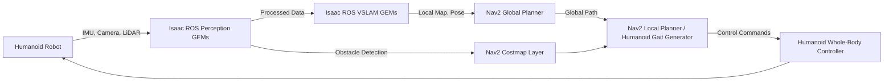

# Perception and Navigation with Isaac ROS

For mobile robots, especially humanoid platforms operating in dynamic, unstructured environments, robust perception and reliable navigation are critical. NVIDIA Isaac ROS offers a suite of GPU-accelerated modules (GEMs) that significantly enhance these capabilities within the ROS 2 framework. This module delves into Visual SLAM (VSLAM) for localization and mapping, and Nav2 for humanoid path planning, both accelerated by Isaac ROS.

## Visual SLAM (VSLAM) for Humanoids

Simultaneous Localization and Mapping (SLAM) is the computational problem of constructing or updating a map of an unknown environment while simultaneously keeping track of an agent's location within it. VSLAM uses visual information from cameras (monocular, stereo, or RGB-D) to perform this task.

### Challenges for Humanoids:
-   **Dynamic Motion**: Bipedal locomotion introduces complex, often unsteady, camera motion.
-   **Self-Occlusion**: Robot's own body parts can occlude camera views.
-   **Computational Load**: Processing high-resolution video streams for feature extraction and pose estimation is computationally intensive.

### Isaac ROS VSLAM GEMs:
Isaac ROS provides highly optimized VSLAM solutions leveraging NVIDIA GPUs. These GEMs accelerate key VSLAM components:
-   **Feature Extraction and Matching**: Using GPU-accelerated algorithms like SIFT or ORB to find and match distinctive points in images.
-   **Pose Graph Optimization**: Efficiently solving non-linear optimization problems to refine camera poses and map features.
-   **Loop Closure Detection**: Recognizing previously visited locations to correct accumulated drift, often using visual bag-of-words techniques.
-   **Sensor Fusion**: Seamlessly integrating visual data with IMU readings (Visual-Inertial Odometry, VIO) for more robust and accurate state estimation, especially critical for humanoids with complex movements.

By offloading these computationally demanding tasks to the GPU, Isaac ROS VSLAM GEMs enable real-time, high-accuracy localization and mapping for humanoids, even with their unique kinematic challenges.

## Nav2 for Humanoid Path Planning

Nav2 is the ROS 2 navigation stack, providing functionalities for robot locomotion from sensing to path planning and control. While originally designed for wheeled robots, its modular nature allows adaptation for humanoids.

### Nav2 Core Components:
-   **Behavior Tree**: Orchestrates various navigation behaviors (e.g., `FollowPath`, `Spin`, `Wait`).
-   **Local Planner**: Generates collision-free velocity commands for short-term obstacle avoidance (e.g., DWB, TEB).
-   **Global Planner**: Generates optimal paths from start to goal given a map (e.g., A*, Dijkstra).
-   **Costmaps**: 2D occupancy grids representing obstacles and environmental costs for planning.
-   **Controller**: Executes the plan and commands the robot.

### Adapting Nav2 for Humanoids:
-   **Locomotion Controller**: The primary adaptation involves replacing or modifying the base controller plugin (e.g., `dwb_controller`) to integrate with the humanoid's whole-body control system for bipedal walking. This controller must generate stable gait patterns and ensure dynamic balance.
-   **State Estimation**: Requires robust state estimation (e.g., using VSLAM/VIO, IMU, proprioceptive feedback) that accurately reflects the humanoid's complex pose.
-   **Footstep Planning**: For bipedal walking, Nav2 might need to be extended with a footstep planner that determines stable foot placements over terrain.
-   **Costmap Generation**: Costmaps must consider the humanoid's unique geometry, balance constraints, and potentially dynamic obstacles that could affect its gait.

### Isaac ROS GEMs for Nav2 Acceleration:
Isaac ROS provides GEMs that can accelerate Nav2's performance:
-   **GPU-accelerated Costmap Generation**: Faster processing of sensor data to update costmaps.
-   **TensorRT-optimized DNNs**: If Nav2 incorporates deep learning models for perception (e.g., object detection for dynamic obstacles), Isaac ROS can accelerate inference.
-   **Image Processing**: GEMs for pre-processing camera and depth sensor data feed into Nav2's perception pipeline.

## Integration Example: Humanoid Navigating a Room



This flow illustrates how raw sensor data from a humanoid robot is processed by Isaac ROS Perception GEMs, feeding into Isaac ROS VSLAM for robust localization and mapping. The resulting map and pose information are then used by Nav2's planning components. The critical element is the custom Humanoid Gait Generator within the local planner, which translates Nav2's path commands into stable bipedal movements, ensuring the robot can effectively and safely navigate its environment. Isaac ROS accelerates the entire perception-to-planning pipeline, making real-time humanoid navigation feasible.
```